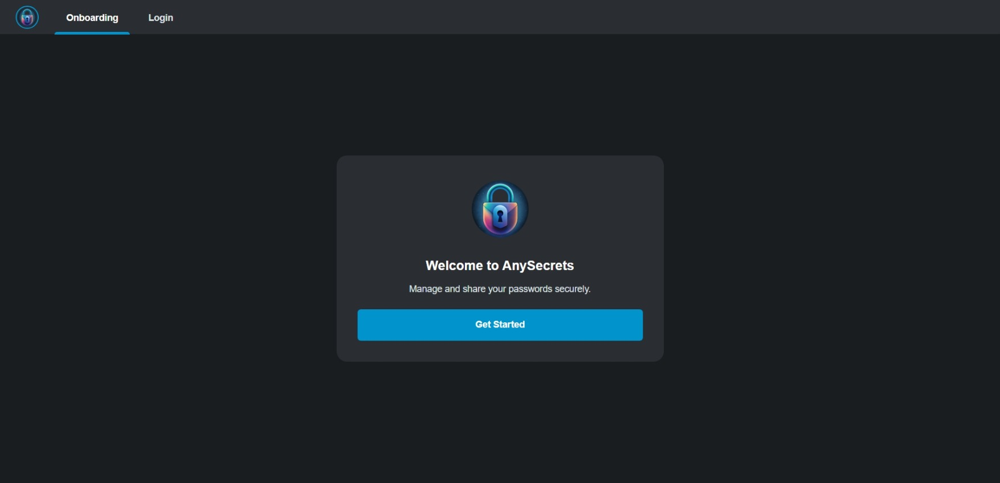
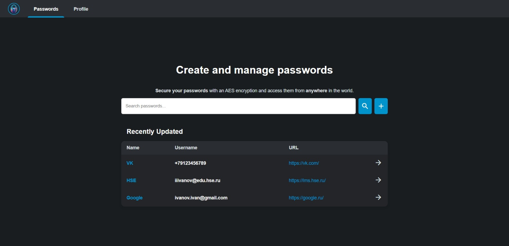
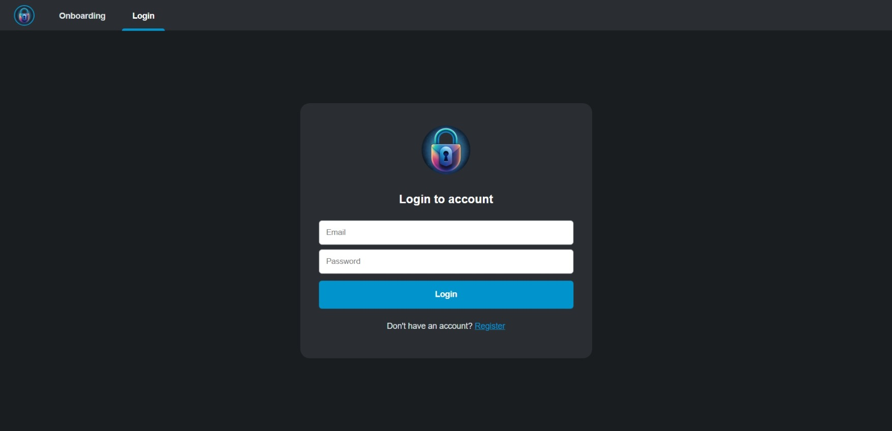
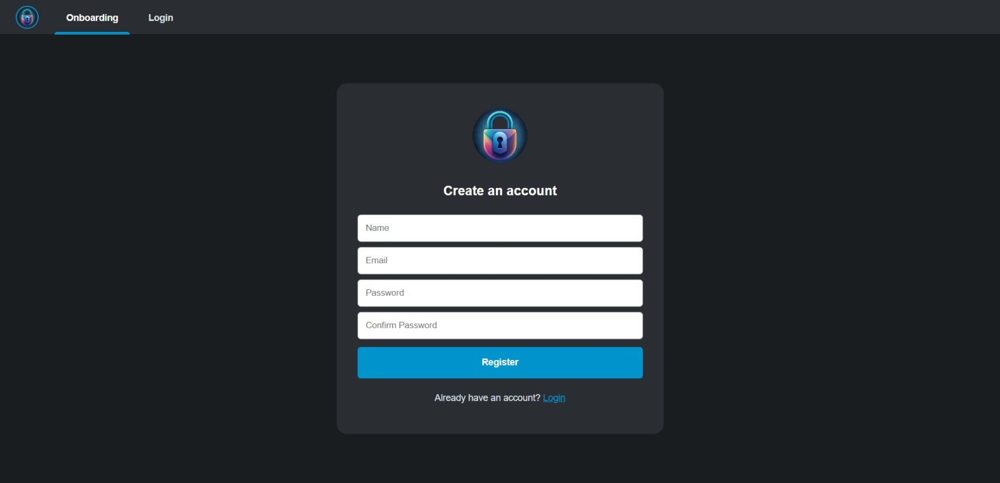
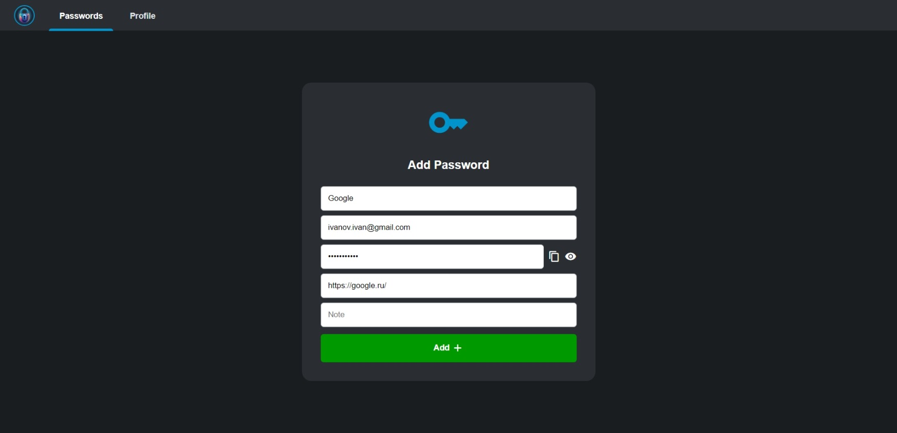
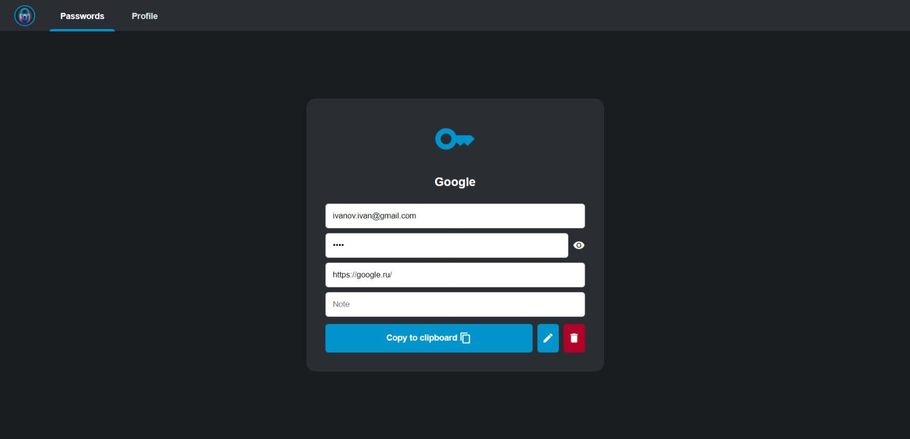
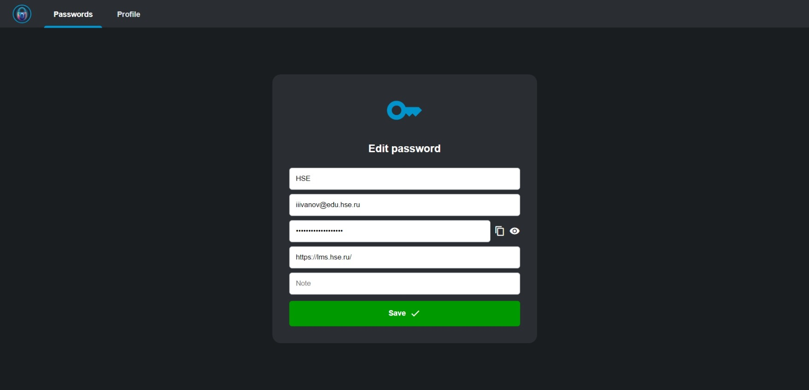

# AnySecrets

**Effortless password management solution**

---

[](https://github.com/everysoftware/anysecrets/actions/workflows/test.yml)
[](https://github.com/everysoftware/anysecrets/actions/workflows/codeql.yml)

---

## Features

* Create and manage passwords safely with an AES-256 encryption
* Search passwords easily by name or URL

## Installation

1. Clone the repository:

    ```bash
    git clone https://github.com/everysoftware/anysecrets
    ```
2. Create `.env` file based on `.env.example`:

    ```bash
    cp .env.example .env
    ```

3. Run the application:

   ```bash
      make up
   ```

AnySecrets is available at [http://localhost:3014](http://localhost:3014):




Enjoy! 🚀

## API Reference

API docs are available at [http://localhost:8014/docs](http://localhost:8014/docs):


## Tech Stack

---

**Backend**: Python, FastAPI, SQLAlchemy, PostgreSQL, cryptography

**Frontend**: Python, FastAPI, Jinja2, HTML, CSS, JS

---

## Screenshots










**Made with ❤️**
