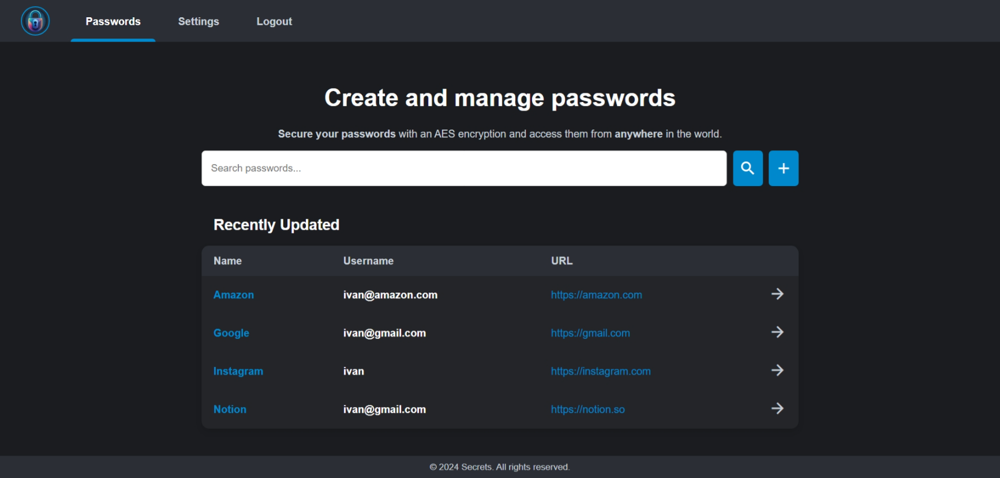
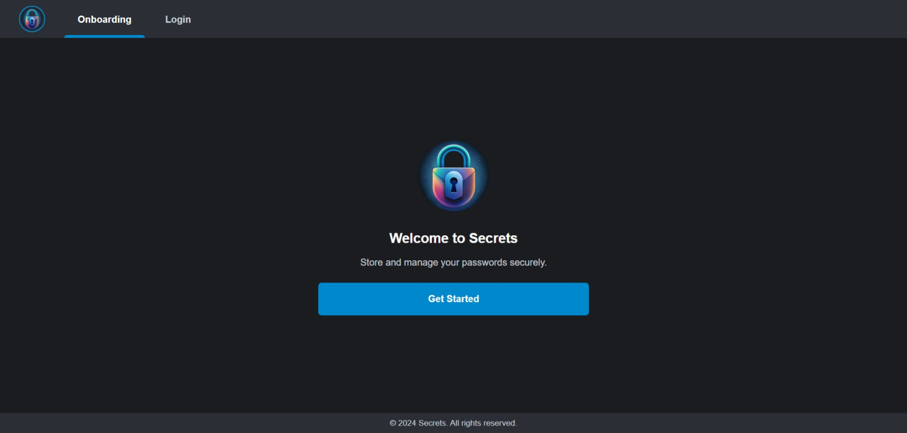
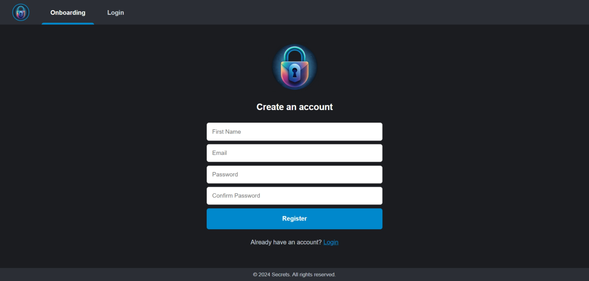
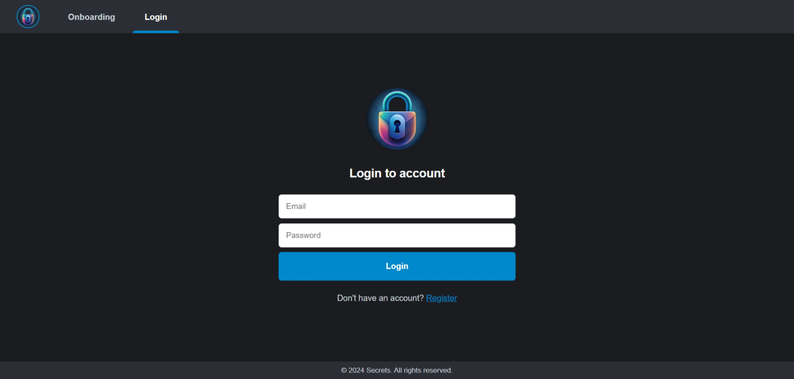
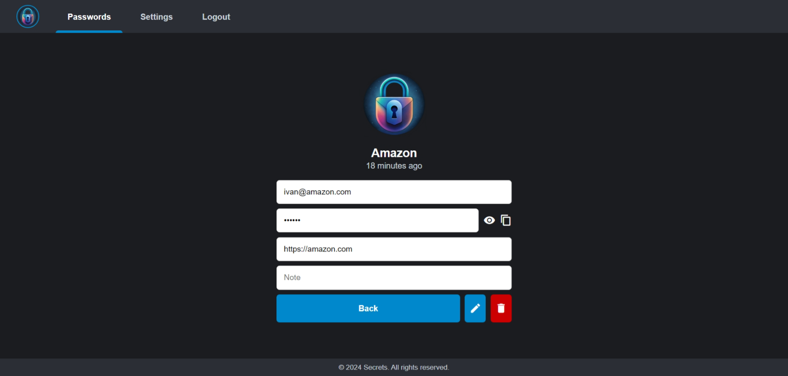
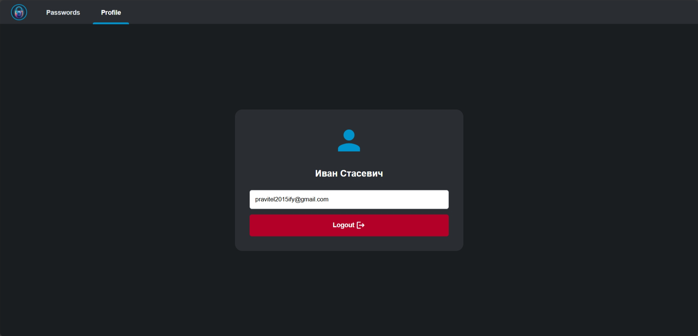
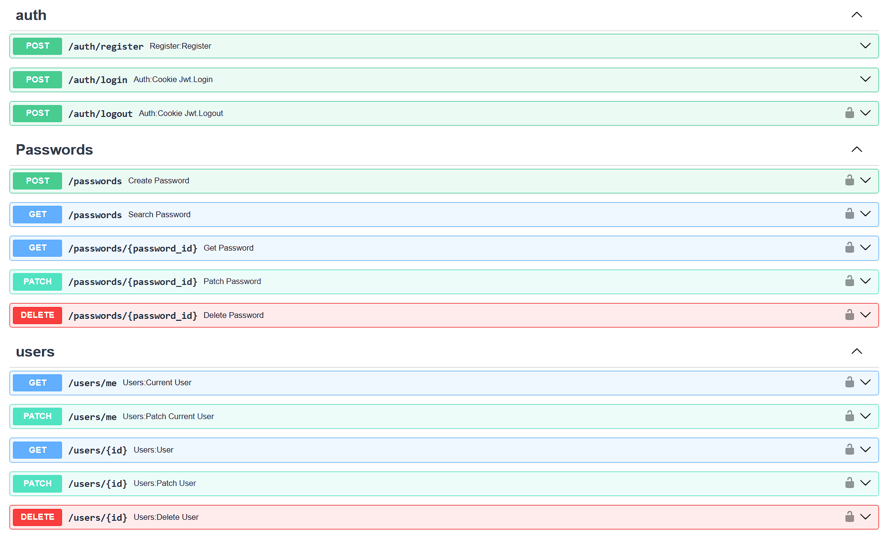

# AnySecrets


Self-hosted password manager with AES Encryption.



## Features

* Create and manage your passwords from anywhere in the world
* Search passwords easily by name or URL
* Protect your passwords with AES encryption

## Stack

**Backend**: Python 3.12, FastAPI, SQLAlchemy, PostgreSQL, cryptography

**Frontend**: Python 3.12, FastAPI, Jinja2, HTML, CSS, JS

## Installation

1. Clone the repository:

    ```bash
    git clone https://github.com/everysoftware/anysecrets
    ```
2. Create `.env` file based on `.env.example`:

    ```bash
    cp .env.example .env
    ```

3. Run the application:

   ```bash
      make up
   ```

## Screenshots








